# FastEmbed Architecture

**Navigation**: [Documentation Index](README.md) → Architecture

This document describes the internal architecture and design of FastEmbed.

## Table of Contents

- [FastEmbed Architecture](#fastembed-architecture)
  - [Table of Contents](#table-of-contents)
  - [System Overview](#system-overview)
  - [Layer Responsibilities](#layer-responsibilities)
    - [1. Application Layer](#1-application-layer)
    - [2. Language Binding Layer](#2-language-binding-layer)
    - [3. C API Layer](#3-c-api-layer)
    - [4. C Implementation Layer](#4-c-implementation-layer)
    - [5. Assembly Layer (SIMD-optimized)](#5-assembly-layer-simd-optimized)
  - [Data Flow](#data-flow)
    - [Hash-Based Embedding Generation (Python Example)](#hash-based-embedding-generation-python-example)
    - [ONNX Embedding Generation](#onnx-embedding-generation)
    - [Batch Embedding Generation](#batch-embedding-generation)
  - [Component Interactions](#component-interactions)
  - [Build System](#build-system)
    - [Build Process Flow](#build-process-flow)
    - [Multi-Platform Build Strategy](#multi-platform-build-strategy)
    - [Makefile Hierarchy](#makefile-hierarchy)
  - [Performance Characteristics](#performance-characteristics)
    - [Hash-Based Embedding Generation](#hash-based-embedding-generation)
    - [Vector Operations (SIMD)](#vector-operations-simd)
  - [Memory Management](#memory-management)
    - [Memory Allocation Strategy](#memory-allocation-strategy)
    - [Allocation Strategy Details](#allocation-strategy-details)
    - [Memory Lifecycle Example](#memory-lifecycle-example)
    - [Thread Safety](#thread-safety)
  - [ABI Compliance (System V x86-64)](#abi-compliance-system-v-x86-64)
  - [Error Handling](#error-handling)
    - [C API](#c-api)
    - [Language Bindings](#language-bindings)
  - [Testing Strategy](#testing-strategy)
    - [Unit Tests](#unit-tests)
    - [Integration Tests](#integration-tests)
  - [ONNX Runtime Integration](#onnx-runtime-integration)
    - [Overview](#overview)
    - [Architecture](#architecture)
    - [Features](#features)
    - [Supported Models](#supported-models)
    - [Performance](#performance)
    - [Requirements](#requirements)
  - [Future Enhancements](#future-enhancements)
    - [Phase 2: GPU Acceleration](#phase-2-gpu-acceleration)
    - [Phase 3: Async APIs](#phase-3-async-apis)
    - [Phase 4: Additional Languages](#phase-4-additional-languages)
  - [References](#references)
  - [See Also](#see-also)
    - [Related Documentation](#related-documentation)
    - [Build Guides](#build-guides)
    - [Additional Resources](#additional-resources)

## System Overview

FastEmbed is a multi-layer system designed for maximum performance and cross-platform compatibility:

```mermaid
graph TB
    subgraph AppLayer["Application Layer"]
        NodeJS["Node.js<br/>JavaScript/TypeScript"]
        Python["Python<br/>NumPy Arrays"]
        CSharp["C#<br/>.NET"]
        Java["Java<br/>JVM"]
        Future["Future: Go, Rust, Ruby"]
    end

    subgraph BindLayer["Language Binding Layer"]
        NAPI["N-API<br/>(Node.js)"]
        PyBind["pybind11<br/>(Python)"]
        PInvoke["P/Invoke<br/>(.NET)"]
        JNI["JNI<br/>(Java)"]
    end

    subgraph CAPI["C API Layer (fastembed.h)"]
        HashAPI["Hash-Based API<br/>fastembed_generate()<br/>fastembed_batch_generate()"]
        ONNXAPI["ONNX API<br/>fastembed_onnx_generate()<br/>fastembed_onnx_unload()<br/>fastembed_onnx_get_model_dimension()"]
        VecAPI["Vector Operations<br/>fastembed_cosine_similarity()<br/>fastembed_dot_product()<br/>fastembed_vector_norm()<br/>fastembed_normalize()<br/>fastembed_add_vectors()"]
    end

    subgraph CImpl["C Implementation Layer"]
        EmbedLib["embedding_lib_c.c<br/>• Input validation<br/>• Assembly wrappers<br/>• Fallback C impl"]
        ONNXLoader["onnx_embedding_loader.c<br/>• ONNX Runtime integration<br/>• Model caching<br/>• Dimension auto-detection"]
    end

    subgraph AsmLayer["Assembly Layer (SIMD-optimized)"]
        AsmCode["embedding_lib.asm<br/>• SSE4/AVX2 instructions<br/>• System V ABI compliant<br/>• Hand-optimized operations"]
    end

    subgraph ExtDeps["External Dependencies"]
        ONNXRT["ONNX Runtime<br/>(Optional)"]
    end

    NodeJS --> NAPI
    Python --> PyBind
    CSharp --> PInvoke
    Java --> JNI
    Future -.-> BindLayer

    NAPI --> CAPI
    PyBind --> CAPI
    PInvoke --> CAPI
    JNI --> CAPI

    HashAPI --> EmbedLib
    VecAPI --> EmbedLib
    ONNXAPI --> ONNXLoader

    EmbedLib --> AsmCode
    ONNXLoader --> ONNXRT
    ONNXLoader --> AsmCode

    classDef appLayer fill:#e1f5ff,stroke:#01579b,stroke-width:2px
    classDef bindLayer fill:#f3e5f5,stroke:#4a148c,stroke-width:2px
    classDef apiLayer fill:#e8f5e9,stroke:#1b5e20,stroke-width:2px
    classDef implLayer fill:#fff3e0,stroke:#e65100,stroke-width:2px
    classDef asmLayer fill:#fce4ec,stroke:#880e4f,stroke-width:2px
    classDef extLayer fill:#f1f8e9,stroke:#33691e,stroke-width:2px

    class NodeJS,Python,CSharp,Java,Future appLayer
    class NAPI,PyBind,PInvoke,JNI bindLayer
    class HashAPI,ONNXAPI,VecAPI apiLayer
    class EmbedLib,ONNXLoader implLayer
    class AsmCode asmLayer
    class ONNXRT extLayer
```



---

## Layer Responsibilities

### 1. Application Layer

**Purpose:** User-facing APIs in native languages (Node.js, Python, C#, Java).

**Responsibilities:**

- Provide idiomatic APIs for each language (e.g., `generate_embedding()` in Python, `generateEmbedding()` in Node.js)
- Handle language-specific data types (numpy arrays, Float32Array, float[], etc.)
- Error handling and exception translation
- Documentation and examples

**Location:** `bindings/nodejs/`, `bindings/python/`, `bindings/csharp/`, `bindings/java/`

---

### 2. Language Binding Layer

**Purpose:** Bridge between high-level languages and the C API.

**Responsibilities:**

- Convert language-native types to C types (strings, arrays, pointers)
- Call C API functions via FFI (Foreign Function Interface)
- Handle memory management (allocation, deallocation, GC integration)
- Ensure thread safety (if applicable)

**Technologies:**

- **Node.js:** N-API (stable ABI across Node versions)
- **Python:** pybind11 (automatic type conversions)
- **C#:** P/Invoke (DllImport for native calls)
- **Java:** JNI (Java Native Interface)

**Location:** `bindings/*/addon/`, `bindings/*/native/`, `bindings/*/src/`

---

### 3. C API Layer

**Purpose:** Universal C interface for all language bindings.

**Responsibilities:**

- Define stable C API with clear function signatures
- Accept C-style arguments (const char*, float*, int)
- Return simple types (float, void) to avoid complex marshaling
- Provide header files (`fastembed.h`, `embedding_lib_c.h`)

**Key Functions:**

**Hash-Based Embeddings:**

- `fastembed_generate(text, output, dimension)` - Generate hash-based embedding
- `fastembed_batch_generate(texts, num_texts, outputs, dimension)` - Batch generation

**ONNX-Based Embeddings:**

- `fastembed_onnx_generate(model_path, text, output, dimension)` - Generate ONNX embedding
- `fastembed_onnx_unload()` - Unload cached ONNX model
- `fastembed_onnx_get_last_error(error_buffer, buffer_size)` - Get last ONNX error
- `fastembed_onnx_get_model_dimension(model_path)` - Get model output dimension

**Vector Operations:**

- `fastembed_cosine_similarity(vec1, vec2, dimension)` - Cosine similarity
- `fastembed_dot_product(vec1, vec2, dimension)` - Dot product
- `fastembed_vector_norm(vec, dimension)` - L2 norm
- `fastembed_normalize(vec, dimension)` - Normalization (in-place)
- `fastembed_add_vectors(vec1, vec2, result, dimension)` - Vector addition

**Location:** `bindings/shared/include/fastembed.h`, `bindings/shared/src/embedding_lib_c.c`, `bindings/shared/src/onnx_embedding_loader.c`

---

### 4. C Implementation Layer

**Purpose:** Thin wrapper around Assembly routines and ONNX Runtime integration, with fallback C implementations.

**Responsibilities:**

- Validate input arguments (null checks, dimension checks)
- Call Assembly functions (e.g., `dot_product_asm`, `cosine_similarity_asm`)
- ONNX Runtime integration (model loading, tokenization, inference)
- Dimension auto-detection for ONNX models
- Model caching for performance
- Provide C fallback implementations if Assembly unavailable (not recommended)
- Handle edge cases (zero-length vectors, NaN/inf values)

**Key Files:**

- `embedding_lib_c.c` - Hash-based embedding and vector operations
- `onnx_embedding_loader.c` - ONNX Runtime integration

**Location:** `bindings/shared/src/`

---

### 5. Assembly Layer (SIMD-optimized)

**Purpose:** Maximum performance via hand-optimized x86-64 Assembly code.

**Responsibilities:**

- Implement hot-path vector operations using SIMD (SSE4, AVX2)
- Follow System V ABI conventions:
  - Save/restore callee-saved registers (rbx, r12-r15, rbp)
  - Maintain 16-byte stack alignment
  - Use standard calling conventions (rdi, rsi, rdx, rcx for first 4 args)
- Minimize memory allocations and cache misses
- Unroll loops for better CPU pipelining

**Key Functions:**

- `dot_product_asm` - SIMD dot product
- `cosine_similarity_asm` - SIMD cosine similarity
- `vector_norm_asm` - SIMD L2 norm calculation
- `normalize_vector_asm` - SIMD vector normalization
- `add_vectors_asm` - SIMD vector addition
- `generate_hash_embedding_asm` - Hash-based embedding generation

**Location:** `bindings/shared/src/embedding_lib.asm`

---

## Data Flow

### Hash-Based Embedding Generation (Python Example)

```mermaid
sequenceDiagram
    participant User as Python User
    participant PyBind as pybind11 Binding
    participant CAPI as C API Layer
    participant CImpl as C Implementation
    participant Asm as Assembly (SIMD)

    User->>PyBind: generate_embedding("machine learning", 768)
    Note over PyBind: Convert: str → const char*<br/>Allocate: numpy.ndarray(768)
    PyBind->>CAPI: fastembed_generate(text, output, 768)
    Note over CAPI: Validate: text != NULL<br/>Validate: dimension in {128,256,512,768,1024,2048}
    CAPI->>CImpl: fastembed_generate() wrapper
    Note over CImpl: Input validation<br/>Dimension check<br/>Null pointer checks
    CImpl->>Asm: generate_hash_embedding_asm(text, output, 768)
    Note over Asm: SIMD hash computation<br/>• Hash each character<br/>• Combine hashes<br/>• Square root normalization<br/>• Write to output buffer
    Asm-->>CImpl: Return (via output pointer)
    CImpl-->>CAPI: Return 0 (success)
    CAPI-->>PyBind: Return 0 (success)
    Note over PyBind: Convert: float* → numpy.ndarray<br/>L2-normalized vector
    PyBind-->>User: Return np.array([0.12, -0.34, ...])
```



### ONNX Embedding Generation


### Batch Embedding Generation


---

## Component Interactions


---

## Build System

### Build Process Flow

```mermaid
flowchart TD
    Start([Start Build]) --> CheckPlatform{Platform?}
    
    CheckPlatform -->|Linux/macOS| LinuxPath[Linux/macOS Path]
    CheckPlatform -->|Windows| WindowsPath[Windows Path]
    
    LinuxPath --> AssembleLinux[NASM: .asm → .o<br/>nasm -f elf64]
    WindowsPath --> AssembleWin[NASM: .asm → .obj<br/>nasm -f win64]
    
    AssembleLinux --> CompileCLinux[GCC/Clang: .c + .o → .so<br/>gcc -shared -fPIC -O3]
    AssembleWin --> CompileCWin[MSVC: .c + .obj → .dll<br/>link /DLL]
    
    CompileCLinux --> CheckONNX{ONNX<br/>Enabled?}
    CompileCWin --> CheckONNX
    
    CheckONNX -->|Yes| LinkONNX[Link ONNX Runtime<br/>-lonnxruntime]
    CheckONNX -->|No| SkipONNX[Skip ONNX Linking]
    
    LinkONNX --> SharedLib[Shared Library<br/>libfastembed.so<br/>fastembed_native.dll]
    SkipONNX --> SharedLib
    
    SharedLib --> BuildBindings[Build Language Bindings]
    
    BuildBindings --> BuildNodeJS[Node.js<br/>node-gyp rebuild]
    BuildBindings --> BuildPython[Python<br/>python setup.py build_ext]
    BuildBindings --> BuildCSharp[C#<br/>dotnet build]
    BuildBindings --> BuildJava[Java<br/>mvn install]
    
    BuildNodeJS --> NodeArtifact[fastembed.node]
    BuildPython --> PyArtifact[fastembed_native.pyd]
    BuildCSharp --> CSArtifact[FastEmbed.dll]
    BuildJava --> JavaArtifact[libfastembed_jni.so]
    
    NodeArtifact --> End([Build Complete])
    PyArtifact --> End
    CSArtifact --> End
    JavaArtifact --> End

    classDef platform fill:#e1f5ff,stroke:#01579b,stroke-width:2px
    classDef compile fill:#f3e5f5,stroke:#4a148c,stroke-width:2px
    classDef binding fill:#e8f5e9,stroke:#1b5e20,stroke-width:2px
    classDef artifact fill:#fff3e0,stroke:#e65100,stroke-width:2px

    class LinuxPath,WindowsPath platform
    class AssembleLinux,AssembleWin,CompileCLinux,CompileCWin,LinkONNX compile
    class BuildNodeJS,BuildPython,BuildCSharp,BuildJava binding
    class SharedLib,NodeArtifact,PyArtifact,CSArtifact,JavaArtifact artifact
```



### Multi-Platform Build Strategy

**Linux/macOS:**

- NASM compiles `.asm` → `.o` (object files)
- GCC/Clang links `.o` + `.c` → `.so` (shared library)
- Language bindings link against `.so`

**Windows:**

- NASM compiles `.asm` → `.obj` (object files)
- MSVC links `.obj` + `.c` → `.dll` (dynamic library)
- Language bindings link against `.dll`

### Makefile Hierarchy

```
fastembed/
├── Makefile                    # Root: build all bindings
├── bindings/
│   ├── shared/
│   │   └── Makefile            # Build shared C/Assembly library
│   ├── nodejs/
│   │   ├── package.json        # npm run build (node-gyp)
│   │   └── binding.gyp         # node-gyp configuration
│   ├── python/
│   │   └── setup.py            # python setup.py build
│   ├── csharp/
│   │   └── FastEmbed.csproj    # dotnet build
│   └── java/
│       └── pom.xml             # mvn install
```

---

## Performance Characteristics

> **📊 Detailed Benchmarks:** See [BENCHMARK_RESULTS.md](../BENCHMARK_RESULTS.md) for comprehensive performance data across all language bindings.

### Hash-Based Embedding Generation

**Algorithm:** Deterministic hash combination

- Time complexity: O(n) where n = text length
- Space complexity: O(d) where d = dimension
- No neural network overhead
- **Measured Performance** (all bindings tested):
  - **Python**: 0.012-0.047 ms (20K-84K ops/sec)
  - **Node.js**: 0.014-0.049 ms (20K-71K ops/sec)
  - **Java**: 0.013-0.048 ms (20K-78K ops/sec)
  - **C#**: 0.014-0.051 ms (19K-71K ops/sec)

**Trade-offs:**

- ✅ Ultra-fast (sub-millisecond generation)
- ✅ Deterministic (same text → same embedding)
- ✅ No model loading
- ❌ No semantic understanding (vs. transformer models)

---

### Vector Operations (SIMD)

**Measured Performance** (all bindings, d=768):

| Operation         | Time Complexity | Avg Time       | Throughput Range | Best (Language)   |
| ----------------- | --------------- | -------------- | ---------------- | ----------------- |
| Dot product       | O(d)            | 0.000-0.001 ms | 1.0M-5.6M ops/s  | **5.6M** (C#)     |
| Cosine similarity | O(d)            | 0.001 ms       | 750K-2.0M ops/s  | **2.0M** (C#)     |
| Vector norm (L2)  | O(d)            | 0.000-0.001 ms | 1.4M-5.7M ops/s  | **5.7M** (C#)     |
| Normalization     | O(d)            | 0.001-0.003 ms | 350K-885K ops/s  | **885K** (Python) |
| Vector addition   | O(d)            | 0.003-0.006 ms | 156K-765K ops/s  | **765K** (Python) |

All operations achieve **sub-microsecond** latency across all bindings, confirming SIMD optimizations are active.

**SIMD Instructions Used:**

- SSE4: `movaps`, `mulps`, `addps`, `haddps`, `sqrtss`
- AVX2: `vmulps`, `vaddps`, `vfmadd231ps` (fused multiply-add)

---

## Memory Management

### Memory Allocation Strategy

```mermaid
graph TB
    subgraph AppMem["Application Memory (GC-Managed)"]
        NodeMem["Node.js<br/>Napi::Float32Array<br/>GC-managed"]
        PyMem["Python<br/>numpy.ndarray<br/>Reference-counted"]
        CSMem["C#<br/>float[]<br/>GC-managed"]
        JavaMem["Java<br/>float[]<br/>GC-managed"]
    end

    subgraph NativeMem["Native Memory (C/Assembly)"]
        StackMem["Stack Allocation<br/>• Temporary variables<br/>• Function parameters<br/>• No dynamic allocation"]
        CallerBuf["Caller-Provided Buffers<br/>• float output[768]<br/>• Pre-allocated by caller<br/>• Zero-copy operations"]
        ONNXCache["ONNX Model Cache<br/>• Model session in memory<br/>• Cached after first load<br/>• Heap-allocated (ONNX Runtime)"]
    end

    subgraph MemFlow["Memory Flow"]
        Alloc["1. Application allocates<br/>output array"]
        Pass["2. Pass pointer to<br/>native code"]
        Process["3. Native code writes<br/>to buffer (zero-copy)"]
        Return["4. Return to application<br/>(GC manages lifecycle)"]
    end

    NodeMem -->|Allocates| Alloc
    PyMem -->|Allocates| Alloc
    CSMem -->|Allocates| Alloc
    JavaMem -->|Allocates| Alloc

    Alloc -->|Pointer| Pass
    Pass -->|Uses| CallerBuf
    CallerBuf -->|Writes| Process
    Process -->|Returns| Return
    Return -->|GC manages| NodeMem
    Return -->|GC manages| PyMem
    Return -->|GC manages| CSMem
    Return -->|GC manages| JavaMem

    ONNXCache -.->|Optional| Process

    classDef appMem fill:#e1f5ff,stroke:#01579b,stroke-width:2px
    classDef nativeMem fill:#f3e5f5,stroke:#4a148c,stroke-width:2px
    classDef flow fill:#e8f5e9,stroke:#1b5e20,stroke-width:2px

    class NodeMem,PyMem,CSMem,JavaMem appMem
    class StackMem,CallerBuf,ONNXCache nativeMem
    class Alloc,Pass,Process,Return flow
```



### Allocation Strategy Details

**C/Assembly Layer:**

- **No dynamic allocation**: Stack-only or caller-provided buffers
- **Caller allocates**: Output arrays (e.g., `float output[768]`)
- **Zero-copy operations**: Direct pointer access, no copying
- **Stack variables**: Temporary calculations use stack

**Language Bindings:**

- **Node.js:** Uses N-API `Napi::Float32Array` (GC-managed, V8 heap)
- **Python:** Uses `numpy.ndarray` (reference-counted, NumPy memory pool)
- **C#:** Uses `float[]` (GC-managed, .NET heap)
- **Java:** Uses `float[]` (GC-managed, JVM heap)

**ONNX Runtime:**

- **Model caching**: ONNX Runtime manages model session memory (heap-allocated)
- **Inference buffers**: ONNX Runtime allocates temporary buffers internally
- **Memory lifecycle**: Managed by ONNX Runtime, freed on `fastembed_onnx_unload()`

### Memory Lifecycle Example


### Thread Safety

**Current Status:** Not thread-safe (single-threaded design)

**Memory Safety:**

- ✅ **Read-only operations**: Safe for concurrent reads (no shared mutable state)
- ⚠️ **Write operations**: Not thread-safe (shared output buffers)
- ⚠️ **ONNX model cache**: Not thread-safe (shared model session)

**Future Work:**

- Add thread-local storage for temporary buffers
- Implement lock-free algorithms for read-only operations
- Provide async APIs for concurrent workloads
- Thread-safe ONNX model caching

---

## ABI Compliance (System V x86-64)

**Callee-Saved Registers:** rbx, rbp, r12, r13, r14, r15

- Assembly functions must preserve these via `push`/`pop`

**Stack Alignment:** 16-byte boundary before `call` instructions

- Adjust rsp via `sub rsp, 8` if needed

**Calling Convention:**

- First 6 integer/pointer args: rdi, rsi, rdx, rcx, r8, r9
- First 8 float args: xmm0-xmm7
- Return values: rax (integer), xmm0 (float)

**Reference:** [System V ABI Documentation](https://refspecs.linuxbase.org/elf/x86_64-abi-0.99.pdf)

---

## Error Handling

### C API

- Return 0 on success, non-zero on error
- No exceptions (C has no exception mechanism)
- Check `errno` for system errors

### Language Bindings

- **Node.js:** Throw JavaScript `Error`
- **Python:** Raise `RuntimeError` or `ValueError`
- **C#:** Throw `FastEmbedException`
- **Java:** Throw `RuntimeException`

---

## Testing Strategy

### Unit Tests

**Location:** Each binding has its own test file

- `bindings/nodejs/test-native.js`
- `bindings/python/test_python_native.py`
- `bindings/csharp/tests/FastEmbed.Tests.csproj` (xUnit test suite, 49+ tests)
- `bindings/java/TestFastEmbedJava.java`

**Coverage:**

- Embedding generation
- Vector operations (all functions)
- Edge cases (empty text, zero vectors, dimension mismatches)
- Performance benchmarks (100-1000 iterations)

### Integration Tests

**Location:** `tests/integration/`

- Weaviate integration (semantic search)
- Multi-language interoperability (same embedding across languages)

---

## ONNX Runtime Integration

### Overview

FastEmbed supports ONNX Runtime for neural network-based embeddings. This provides learned semantic embeddings as opposed to hash-based embeddings.

### Architecture


### Features

- **Model Caching**: ONNX models are cached in memory after first load for improved performance
- **Dimension Auto-Detection**: Automatically detects model output dimension
- **Dimension Validation**: Validates user-specified dimension against model output
- **Error Handling**: Detailed error messages via `fastembed_onnx_get_last_error()` (Node.js only)
- **L2 Normalization**: Output embeddings are automatically L2-normalized (unit vectors)

### Supported Models

- BERT-based models (e.g., `nomic-embed-text`)
- Sentence transformers
- Any ONNX embedding model with compatible input/output format

### Performance

- First call: Model loading overhead (~100-500ms depending on model size)
- Subsequent calls: Fast inference (~10-50ms per embedding, depending on text length and model)
- Model caching eliminates reload overhead

### Requirements

- ONNX Runtime 1.23.2+ installed and linked at compile time
- Compile with `-DUSE_ONNX_RUNTIME` flag
- ONNX model file (.onnx format)

---

## Future Enhancements

### Phase 2: GPU Acceleration

- CUDA support for NVIDIA GPUs
- ROCm support for AMD GPUs
- Automatic fallback to CPU if GPU unavailable

### Phase 3: Async APIs

- Promise-based API (Node.js)
- `async`/`await` support (Python, C#, Java)
- Thread pool for parallel processing

### Phase 4: Additional Languages

- Go binding (via cgo)
- Rust binding (via FFI)
- Ruby binding (via FFI)

---

## References

- [System V ABI x86-64](https://refspecs.linuxbase.org/elf/x86_64-abi-0.99.pdf)
- [Intel SIMD Intrinsics Guide](https://www.intel.com/content/www/us/en/docs/intrinsics-guide/index.html)
- [Node.js N-API Documentation](https://nodejs.org/api/n-api.html)
- [pybind11 Documentation](https://pybind11.readthedocs.io/)
- [P/Invoke Documentation](https://learn.microsoft.com/en-us/dotnet/standard/native-interop/pinvoke)
- [JNI Specification](https://docs.oracle.com/en/java/javase/11/docs/specs/jni/)

---

## See Also

### Related Documentation

- **[API Reference](API.md)** - Complete API documentation for all language bindings
- **[Algorithm Specification](ALGORITHM_SPECIFICATION.md)** - Hash-based embedding algorithm details
- **[Algorithm Math](ALGORITHM_MATH.md)** - Mathematical foundation and theory
- **[Assembly Design](ASSEMBLY_DESIGN.md)** - Low-level SIMD implementation details
- **[Use Cases](USE_CASES.md)** - Real-world scenarios and applications

### Build Guides

- **[Build CMake](BUILD_CMAKE.md)** - Cross-platform CMake build (recommended)
- **[Build Windows](BUILD_WINDOWS.md)** - Windows-specific build instructions
- **[Build Native](BUILD_NATIVE.md)** - Node.js N-API module build
- **[Build Python](BUILD_PYTHON.md)** - Python pybind11 module build
- **[Build C#](BUILD_CSHARP.md)** - C# P/Invoke module build
- **[Build Java](BUILD_JAVA.md)** - Java JNI module build

### Additional Resources

- **[Documentation Index](README.md)** - Complete documentation overview
- **[Benchmarks](BENCHMARKS.md)** - Performance testing guide
- **[Main README](../README.md)** - Project overview and quick start
